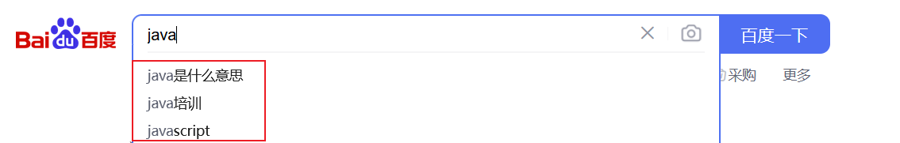
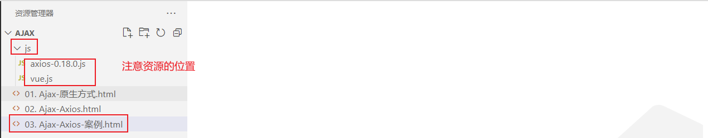
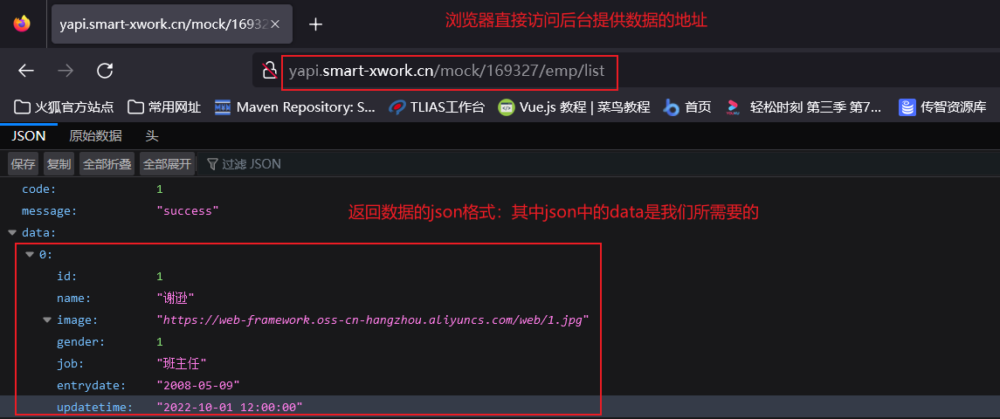

# 1 Ajax

## 1.1 Ajax介绍

### 1.1.1 Ajax概述

我们前端页面中的数据，如下图所示的表格中的学生信息，应该来自于后台，那么我们的后台和前端是互不影响的2个程序，那么我们前端应该如何从后台获取数据呢？因为是2个程序，所以必须涉及到2个程序的交互，所以这就需要用到我们接下来学习的Ajax技术。

 

Ajax: 全称Asynchronous JavaScript And XML，异步的JavaScript和XML。其作用有如下2点：

- 与服务器进行数据交换：通过Ajax可以给服务器发送请求，并获取服务器响应的数据。
- 异步交互：可以在**不重新加载整个页面**的情况下，与服务器交换数据并**更新部分网页**的技术，如：搜索联想、用户名是否可用的校验等等。


### 1.1.2 Ajax作用

我们详细的解释一下Ajax技术的2个作用

- 与服务器进行数据交互

  如下图所示前端资源被浏览器解析，但是前端页面上缺少数据，前端可以通过Ajax技术，向后台服务器发起请求，后台服务器接受到前端的请求，从数据库中获取前端需要的资源，然后响应给前端，前端在通过我们学习的vue技术，可以将数据展示到页面上，这样用户就能看到完整的页面了。此处可以对比JavaSE中的网络编程技术来理解。

  

- 异步交互：可以在**不重新加载整个页面**的情况下，与服务器交换数据并**更新部分网页**的技术。

  如下图所示，当我们再百度搜索java时，下面的联想数据是通过Ajax请求从后台服务器得到的，在整个过程中，我们的Ajax请求不会导致整个百度页面的重新加载，并且只针对搜索栏这局部模块的数据进行了数据的更新，不会对整个页面的其他地方进行数据的更新，这样就大大提升了页面的加载速度，用户体验高。

    

 

### 1.1.3 同步异步

针对于上述Ajax的局部刷新功能是因为Ajax请求是异步的，与之对应的有同步请求。接下来我们介绍一下异步请求和同步请求的区别。

- 同步请求发送过程如下图所示：

  

  浏览器页面在发送请求给服务器，在服务器处理请求的过程中，浏览器页面不能做其他的操作。只能等到服务器响应结束后才能，浏览器页面才能继续做其他的操作。 

- 异步请求发送过程如下图所示：

   

  浏览器页面发送请求给服务器，在服务器处理请求的过程中，浏览器页面还可以做其他的操作。


## 1.2 原生Ajax

对于Ajax技术有了充分的认知了，我们接下来通过代码来演示Ajax的效果。此处我们先采用原生的Ajax代码来演示。因为Ajax请求是基于客户端发送请求，服务器响应数据的技术。所以为了完成快速入门案例，我们需要提供服服务器端和编写客户端。

- 服务器端

  因为我们暂时还没学过服务器端的代码，所以此处已经直接提供好了服务器端的请求地址，我们前端直接通过Ajax请求访问该地址即可。**后台服务器地址**：http://yapi.smart-xwork.cn/mock/169327/emp/list

  上述地址我们也可以直接通过浏览器来访问，访问结果如图所示：只截取部分数据

  

- 客户端

  客户端的Ajax请求代码如下有如下4步，接下来我们跟着步骤一起操作一下。

  第一步：首先我们再VS Code中创建AJAX的文件夹，并且创建名为01. Ajax-原生方式.html的文件，提供如下代码，主要是按钮绑定单击事件，我们希望点击按钮，来发送ajax请求

  ~~~html
  <!DOCTYPE html>
  <html lang="en">
  <head>
      <meta charset="UTF-8">
      <meta http-equiv="X-UA-Compatible" content="IE=edge">
      <meta name="viewport" content="width=device-width, initial-scale=1.0">
      <title>原生Ajax</title>
  </head>
  <body>
      
      <input type="button" value="获取数据" onclick="getData()">
  
      <div id="div1"></div>
      
  </body>
  <script>
      function getData(){
       
      }
  </script>
  </html>
  ~~~

  第二步：创建XMLHttpRequest对象，用于和服务器交换数据，也是原生Ajax请求的核心对象，提供了各种方法。代码如下：

  ~~~js
  //1. 创建XMLHttpRequest 
  var xmlHttpRequest  = new XMLHttpRequest();
  ~~~

  第三步：调用对象的open()方法设置请求的参数信息，例如请求地址，请求方式。然后调用send()方法向服务器发送请求，代码如下：

  ~~~js
  //2. 发送异步请求
  xmlHttpRequest.open('GET','http://yapi.smart-xwork.cn/mock/169327/emp/list');
  xmlHttpRequest.send();//发送请求
  ~~~

  第四步：我们通过绑定事件的方式，来获取服务器响应的数据。

  ~~~js
  //3. 获取服务响应数据
  xmlHttpRequest.onreadystatechange = function(){
      //此处判断 4表示浏览器已经完全接受到Ajax请求得到的响应， 200表示这是一个正确的Http请求，没有错误
      if(xmlHttpRequest.readyState == 4 && xmlHttpRequest.status == 200){
          document.getElementById('div1').innerHTML = xmlHttpRequest.responseText;
      }
  }
  ~~~


  最后我们通过浏览器打开页面，请求点击按钮，发送Ajax请求，最终显示结果如下图所示：

   

  并且通过浏览器的f12抓包，我们点击网络中的XHR请求，发现可以抓包到我们发送的Ajax请求。XHR代表的就是异步请求


## 1.3 Axios

上述原生的Ajax请求的代码编写起来还是比较繁琐的，所以接下来我们学习一门更加简单的发送Ajax请求的技术Axios 。Axios是对原生的AJAX进行封装，简化书写。Axios官网是：`https://www.axios-http.cn`

### 1.3.1 Axios的基本使用

Axios的使用比较简单，主要分为2步：

- 引入Axios文件

  ~~~html
  <script src="js/axios-0.18.0.js"></script>
  ~~~

- 使用Axios发送请求，并获取响应结果，官方提供的api很多，此处给出2种，如下

  - 发送 get 请求

    ~~~js
    axios({
        method:"get",
        url:"http://localhost:8080/ajax-demo1/aJAXDemo1?username=zhangsan"
    }).then(function (resp){
        alert(resp.data);
    })
    ~~~

  - 发送 post 请求

    ```js
    axios({
        method:"post",
        url:"http://localhost:8080/ajax-demo1/aJAXDemo1",
        data:"username=zhangsan"
    }).then(function (resp){
        alert(resp.data);
    });
    ```

  axios()是用来发送异步请求的，小括号中使用 js的JSON对象传递请求相关的参数：

  - method属性：用来设置请求方式的。取值为 get 或者 post。
  - url属性：用来书写请求的资源路径。如果是 get 请求，需要将请求参数拼接到路径的后面，格式为： url?参数名=参数值&参数名2=参数值2。
  - data属性：作为请求体被发送的数据。也就是说如果是 post 请求的话，数据需要作为 data 属性的值。

  then() 需要传递一个匿名函数。我们将 then()中传递的匿名函数称为 **回调函数**，意思是该匿名函数在发送请求时不会被调用，而是在成功响应后调用的函数。而该回调函数中的 resp 参数是对响应的数据进行封装的对象，通过 resp.data 可以获取到响应的数据。

  

### 1.3.2 Axios快速入门

- 后端实现

  查询所有员工信息服务器地址：http://yapi.smart-xwork.cn/mock/169327/emp/list 

  根据员工id删除员工信息服务器地址：http://yapi.smart-xwork.cn/mock/169327/emp/deleteById

- 前端实现

  首先在VS Code中创建js文件夹，与html同级，然后将**资料/axios-0.18.0.js** 文件拷贝到js目录下，然后创建名为02. Ajax-Axios.html的文件，工程结果如图所示：

   

   

  然后在html中引入axios所依赖的js文件，并且提供2个按钮，绑定单击事件，分别用于点击时发送ajax请求，完整代码如下：

  ~~~html
  <!DOCTYPE html>
  <html lang="en">
  <head>
      <meta charset="UTF-8">
      <meta http-equiv="X-UA-Compatible" content="IE=edge">
      <meta name="viewport" content="width=device-width, initial-scale=1.0">
      <title>Ajax-Axios</title>
      <script src="js/axios-0.18.0.js"></script>
  </head>
  <body>
      
      <input type="button" value="获取数据GET" onclick="get()">
  
      <input type="button" value="删除数据POST" onclick="post()">
  
  </body>
  <script>
      function get(){
          //通过axios发送异步请求-get
      }
  
      function post(){
          //通过axios发送异步请求-post
      }
  </script>
  </html>
  ~~~

  然后分别使用Axios的方法，完整get请求和post请求的发送

  get请求代码如下：

  ~~~js
  //通过axios发送异步请求-get
   axios({
       method: "get",
       url: "http://yapi.smart-xwork.cn/mock/169327/emp/list"
   }).then(result => {
       console.log(result.data);
   })
  ~~~

  post请求代码如下：

  ~~~js
  //通过axios发送异步请求-post
   axios({
       method: "post",
       url: "http://yapi.smart-xwork.cn/mock/169327/emp/deleteById",
       data: "id=1"
   }).then(result => {
       console.log(result.data);
   })
  ~~~

  浏览器打开，f12抓包，然后分别点击2个按钮，查看控制台效果如下：

   

  

  完整代码如下：

  ~~~html
  <!DOCTYPE html>
  <html lang="en">
  <head>
      <meta charset="UTF-8">
      <meta http-equiv="X-UA-Compatible" content="IE=edge">
      <meta name="viewport" content="width=device-width, initial-scale=1.0">
      <title>Ajax-Axios</title>
      <script src="js/axios-0.18.0.js"></script>
  </head>
  <body>
      
      <input type="button" value="获取数据GET" onclick="get()">
  
      <input type="button" value="删除数据POST" onclick="post()">
  
  </body>
  <script>
      function get(){
          //通过axios发送异步请求-get
          axios({
              method: "get",
              url: "http://yapi.smart-xwork.cn/mock/169327/emp/list"
          }).then(result => {
              console.log(result.data);
          })
  
  
      }
  
      function post(){
         // 通过axios发送异步请求-post
          axios({
              method: "post",
              url: "http://yapi.smart-xwork.cn/mock/169327/emp/deleteById",
              data: "id=1"
          }).then(result => {
              console.log(result.data);
          })
  
      }
  </script>
  </html>
  ~~~


### 1.3.3 请求方法的别名

Axios还针对不同的请求，提供了别名方式的api,具体如下：

| 方法                               | 描述           |
| ---------------------------------- | -------------- |
| axios.get(url [, config])          | 发送get请求    |
| axios.delete(url [, config])       | 发送delete请求 |
| axios.post(url [, data[, config]]) | 发送post请求   |
| axios.put(url [, data[, config]])  | 发送put请求    |

我们目前只关注get和post请求，所以在上述的入门案例中，我们可以将get请求代码改写成如下：

~~~js
axios.get("http://yapi.smart-xwork.cn/mock/169327/emp/list").then(result => {
    console.log(result.data);
})
~~~

post请求改写成如下：

~~~js
axios.post("http://yapi.smart-xwork.cn/mock/169327/emp/deleteById","id=1").then(result => {
    console.log(result.data);
})
~~~


### 1.3.4 案例

- 需求：基于Vue及Axios完成数据的动态加载展示，如下图所示

   

  其中数据是来自于后台程序的，地址是：http://yapi.smart-xwork.cn/mock/169327/emp/list

  

- 分析：

  前端首先是一张表格，我们缺少数据，而提供数据的地址已经有了，所以意味这我们需要使用Ajax请求获取后台的数据。但是Ajax请求什么时候发送呢？页面的数据应该是页面加载完成，自动发送请求，展示数据，所以我们需要借助vue的mounted钩子函数。那么拿到数据了，我们该怎么将数据显示表格中呢？这里就得借助v-for指令来遍历数据，展示数据。

- 步骤：

  1. 首先创建文件，提前准备基础代码，包括表格以及vue.js和axios.js文件的引入
  2. 我们需要在vue的mounted钩子函数中发送ajax请求，获取数据
  3. 拿到数据，数据需要绑定给vue的data属性
  4. 在&lt;tr&gt;标签上通过v-for指令遍历数据，展示数据

- 代码实现：

  1. 首先创建文件，提前准备基础代码，包括表格以及vue.js和axios.js文件的引入

     

     提供初始代码如下：

     ~~~html
     <!DOCTYPE html>
     <html lang="en">
     <head>
         <meta charset="UTF-8">
         <meta http-equiv="X-UA-Compatible" content="IE=edge">
         <meta name="viewport" content="width=device-width, initial-scale=1.0">
         <title>Ajax-Axios-案例</title>
         <script src="js/axios-0.18.0.js"></script>
         <script src="js/vue.js"></script>
     </head>
     <body>
         <div id="app">
             <table border="1" cellspacing="0" width="60%">
                 <tr>
                     <th>编号</th>
                     <th>姓名</th>
                     <th>图像</th>
                     <th>性别</th>
                     <th>职位</th>
                     <th>入职日期</th>
                     <th>最后操作时间</th>
                 </tr>
     
                 <tr align="center" >
                     <td>1</td>
                     <td>Tom</td>
                     <td>
                         
                     </td>
                     <td>
                         <span>男</span>
                        <!-- <span>女</span>-->
                     </td>
                     <td>班主任</td>
                     <td>2009-08-09</td>
                     <td>2009-08-09 12:00:00</td>
                 </tr>
             </table>
         </div>
     </body>
     <script>
         new Vue({
            el: "#app",
            data: {
             
            }
         });
     </script>
     </html>
     ~~~

  2. 在vue的mounted钩子函数，编写Ajax请求，请求数据，代码如下：

     ~~~js
     mounted () {
         //发送异步请求,加载数据
         axios.get("http://yapi.smart-xwork.cn/mock/169327/emp/list").then(result => {
             
         })
     }
     ~~~

  3. ajax请求的数据我们应该绑定给vue的data属性，之后才能进行数据绑定到视图；并且浏览器打开后台地址，数据返回格式如下图所示：

      

     因为服务器响应的json中的data属性才是我们需要展示的信息，所以我们应该将员工列表信息赋值给vue的data属性，代码如下：

     ~~~js
      //发送异步请求,加载数据
     axios.get("http://yapi.smart-xwork.cn/mock/169327/emp/list").then(result => {
         this.emps = result.data.data;
     })
     ~~~

     其中，data中生命emps变量，代码如下：

     ~~~js
     data: {
         emps:[]
     },
     ~~~

  4. 在&lt;tr&gt;标签上通过v-for指令遍历数据，展示数据，其中需要注意的是图片的值，需要使用vue的属性绑定，男女的展示需要使用条件判断，其代码如下：

     ~~~html
     <tr align="center" v-for="(emp,index) in emps">
         <td>{{index + 1}}</td>
         <td>{{emp.name}}</td>
         <td>
             
         </td>
         <td>
             <span v-if="emp.gender == 1">男</span>
             <span v-if="emp.gender == 2">女</span>
         </td>
         <td>{{emp.job}}</td>
         <td>{{emp.entrydate}}</td>
         <td>{{emp.updatetime}}</td>
     </tr>
     ~~~

完整代码如下：

~~~html
<!DOCTYPE html>
<html lang="en">
<head>
    <meta charset="UTF-8">
    <meta http-equiv="X-UA-Compatible" content="IE=edge">
    <meta name="viewport" content="width=device-width, initial-scale=1.0">
    <title>Ajax-Axios-案例</title>
    <script src="js/axios-0.18.0.js"></script>
    <script src="js/vue.js"></script>
</head>
<body>
    <div id="app">
        <table border="1" cellspacing="0" width="60%">
            <tr>
                <th>编号</th>
                <th>姓名</th>
                <th>图像</th>
                <th>性别</th>
                <th>职位</th>
                <th>入职日期</th>
                <th>最后操作时间</th>
            </tr>

            <tr align="center" v-for="(emp,index) in emps">
                <td>{{index + 1}}</td>
                <td>{{emp.name}}</td>
                <td>
                    
                </td>
                <td>
                    <span v-if="emp.gender == 1">男</span>
                    <span v-if="emp.gender == 2">女</span>
                </td>
                <td>{{emp.job}}</td>
                <td>{{emp.entrydate}}</td>
                <td>{{emp.updatetime}}</td>
            </tr>
        </table>
    </div>
</body>
<script>
    new Vue({
       el: "#app",
       data: {
         emps:[]
       },
       mounted () {
          //发送异步请求,加载数据
          axios.get("http://yapi.smart-xwork.cn/mock/169327/emp/list").then(result => {
            console.log(result.data);
            this.emps = result.data.data;
          })
       }
    });
</script>
</html>
~~~


